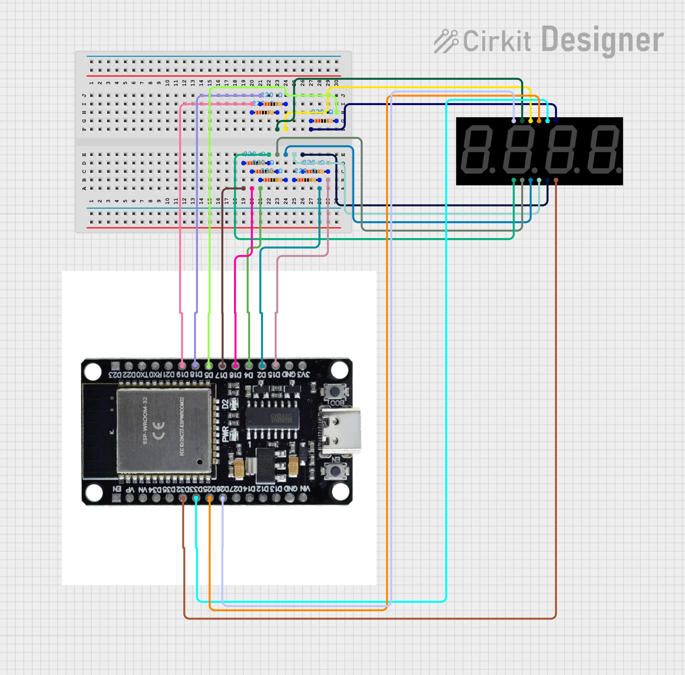

# 3641AS Seven Segment Display

An embedded Rust library to drive a 7 segment, 4 digit display (the 3641AS
display). See module documentation for more details.

Here's an example:

```rust
    let segment_config = SegmentConfiguration {
        a: new_output_pin(peripherals.GPIO19), // PIN 11
        b: new_output_pin(peripherals.GPIO5),  // PIN 7
        c: new_output_pin(peripherals.GPIO2),  // PIN 4
        d: new_output_pin(peripherals.GPIO16), // PIN 2
        e: new_output_pin(peripherals.GPIO17), // PIN 1
        f: new_output_pin(peripherals.GPIO18), // PIN 10
        g: new_output_pin(peripherals.GPIO15), // PIN 5
        dp: new_output_pin(peripherals.GPIO4), // PIN 3
    };
    // Start with the lowest digit as SevenSegment expects this array order.
    let digits = [
        new_output_pin(peripherals.GPIO32), // DIG4 - PIN 6
        new_output_pin(peripherals.GPIO33), // DIG3 - PIN 8
        new_output_pin(peripherals.GPIO25), // DIG2 - PIN 9
        new_output_pin(peripherals.GPIO26), // DIG1 - PIN 12
    ];
    let display = match SevenSegment::new(segment_config, digits).unwrap();
    display.show(1234).unwrap();
    let delay = Delay::new();
    loop {
        display.tick();
        delay.delay_millis(2);
    }
```

Use a `180 Ohm` resistor (anything from `150 - 220` should work just fine) on
each of the segments and adjust the GPIO pins based on your wiring.

 ([Source](https://app.cirkitdesigner.com/project/a2e83efa-3fae-4d70-8e90-36cdb79f6d9f))
